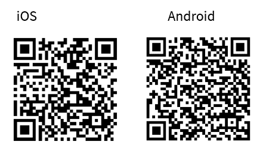

# Bluetooth&reg; LE Hello Client

This code example demonstrates the implementation of Bluetooth&reg; LE multi role application using AIROC&trade; CYW20829/CYW89829, PSoC&trade; 6 MCU and CYW43xxx connectivity devices, and ModusToolbox&trade; software environment. The device acts as GAP Central and Peripheral and can connect with multiple peers.

This Code Example requires [Bluetooth&reg; LE Hello Sensor](https://github.com/Infineon/mtb-example-btstack-freertos-hello-sensor) for it's operation.

[View this README on GitHub.](https://github.com/Infineon/mtb-example-btstack-freertos-hello-client)

[Provide feedback on this code example.](https://cypress.co1.qualtrics.com/jfe/form/SV_1NTns53sK2yiljn?Q_EED=eyJVbmlxdWUgRG9jIElkIjoiQ0UyMzUxOTkiLCJTcGVjIE51bWJlciI6IjAwMi0zNTE5OSIsIkRvYyBUaXRsZSI6IkJsdWV0b290aCZyZWc7IExFIEhlbGxvIENsaWVudCIsInJpZCI6Im5oZWciLCJEb2MgdmVyc2lvbiI6IjEuMy4wIiwiRG9jIExhbmd1YWdlIjoiRW5nbGlzaCIsIkRvYyBEaXZpc2lvbiI6Ik1DRCIsIkRvYyBCVSI6IklDVyIsIkRvYyBGYW1pbHkiOiJCVEFCTEUifQ==)

## Requirements

- [ModusToolbox&trade; software](https://www.infineon.com/modustoolbox) v3.0 or later (tested with v3.0)
- Board support package (BSP) minimum required version for :
   - CYW920829M2EVK-02 : v1.0.1
   - CYW989829M2EVB-01 : v1.0.1
   - Other BSPs : 4.0.0
- Programming language: C
- Associated parts:[PSoC&trade; 6 MCU](https://www.infineon.com/cms/en/product/microcontroller/32-bit-psoc-arm-cortex-microcontroller/psoc-6-32-bit-arm-cortex-m4-mcu/) with [AIROC&trade; CYW43xxx Wi-Fi & Bluetooth® combo chips](https://www.infineon.com/cms/en/product/wireless-connectivity/airoc-wi-fi-plus-bluetooth-combos/) and [AIROC&trade; CYW20829 Bluetooth® LE SoC](https://www.infineon.com/cms/en/product/promopages/airoc20829)


## Supported toolchains (make variable 'TOOLCHAIN')

- GNU Arm&reg; embedded compiler  v10.3.1 (`GCC_ARM`) - Default value of `TOOLCHAIN`
- IAR C/C++ compiler v9.30.1 (`IAR`)


## Supported kits (make variable 'TARGET')

- [AIROC&trade; CYW20829 Bluetooth&reg; LE evaluation kit](https://www.infineon.com/CYW920829M2EVK-02) (`CYW920829M2EVK-02`) – Default value of `TARGET`
- AIROC&trade; CYW89829 Bluetooth&reg; LE evaluation kit (`CYW989829M2EVB-01`)
- [PSoC&trade; 62S2 Wi-Fi Bluetooth&reg; pioneer kit](https://www.infineon.com/CY8CKIT-062S2-43012) (`CY8CKIT-062S2-43012`)


## Hardware setup

This example uses the board's default configuration. See the kit user guide to ensure that the board is configured correctly.

**Note:** The PSoC&trade; 6 Bluetooth&reg; LE Pioneer Kit (CY8CKIT-062-BLE) and the PSoC&trade; 6 Wi-Fi Bluetooth&reg; Pioneer Kit (CY8CKIT-062-WIFI-BT) ship with KitProg2 installed. ModusToolbox&trade; requires KitProg3. Before using this code example, make sure that the board is upgraded to KitProg3. The tool and instructions are available in the [Firmware Loader](https://github.com/Infineon/Firmware-loader) GitHub repository. If you do not upgrade, you will see an error like "unable to find CMSIS-DAP device" or "KitProg firmware is out of date".

The AIROC&trade; CYW20829 Bluetooth&reg; kit (CYW920829M2EVK-02) ships with KitProg3 version 2.21 installed. The ModusToolbox&trade; software requires KitProg3 with latest version 2.40. Before using this code example, make sure that the board is upgraded to KitProg3. The tool and instructions are available in the Firmware Loader GitHub repository. If you do not upgrade, you will see an error such as "unable to find CMSIS-DAP device" or "KitProg firmware is out of date".

## Software setup

See the [ModusToolbox&trade; tools package installation guide](https://www.infineon.com/ModusToolboxInstallguide) for information about installing and configuring the tools package.

Download and install the AIROC&trade; Bluetooth&reg; Connect App on your [Android](https://play.google.com/store/apps/details?id=com.infineon.airocbluetoothconnect) or [iOS](https://apps.apple.com/in/app/airoc-bluetooth-connect-app/id6443702288) phone.
Scan the following QR codes from your mobile phone to download the AIROC&trade; Bluetooth&reg; Connect app.



Install a terminal emulator if you don't have one. Instructions in this document use [Tera Term](https://ttssh2.osdn.jp/index.html.en).

## Using the code example

### Create the project

The ModusToolbox&trade; tools package provides the Project Creator as both a GUI tool and a command line tool.

<details><summary><b>Use Project Creator GUI</b></summary>

1. Open the Project Creator GUI tool.

   There are several ways to do this, including launching it from the dashboard or from inside the Eclipse IDE for ModusToolbox&trade;. For more details, see the [Project Creator user guide](https://www.infineon.com/ModusToolboxProjectCreator) (locally available at *{ModusToolbox&trade; install directory}/tools_{version}/project-creator/docs/project-creator.pdf*).

2. On the **Choose Board Support Package (BSP)** page, select a kit supported by this code example. See [Supported kits](#supported-kits-make-variable-target).

   > **Note:** To use this code example for a kit not listed here, you may need to update the source files. If the kit does not have the required resources, the application may not work.

3. On the **Select Application** page:

   a. Select the **Applications(s) Root Path** and the **Target IDE**.

   > **Note:** Depending on how you open the Project Creator tool, these fields may be pre-selected for you.

   b.	Select this code example from the list by enabling its check box.


   > **Note:** You can narrow the list of displayed examples by typing in the filter box.

   c. (Optional) Change the suggested **New Application Name** and **New BSP Name**.

   d. Click **Create** to complete the application creation process.

</details>


<details><summary><b>Use Project Creator CLI</b></summary>

The 'project-creator-cli' tool can be used to create applications from a CLI terminal or from within batch files or shell scripts. This tool is available in the *{ModusToolbox&trade; install directory}/tools_{version}/project-creator/* directory.

Use a CLI terminal to invoke the 'project-creator-cli' tool. On Windows, use the command line 'modus-shell' program provided in the ModusToolbox&trade; installation instead of a standard Windows command-line application. This shell provides access to all ModusToolbox&trade; tools. You can access it by typing "modus-shell" in the search box in the Windows menu. In Linux and macOS, you can use any terminal application.

The following example clones the "[Hello world](https://github.com/Infineon/mtb-example-psoc6-hello-world)" application with the desired name "MyHelloWorld" configured for the *CY8CPROTO-062S2-43439* BSP into the specified working directory, *C:/mtb_projects*:

   ```
   project-creator-cli --board-id CY8CPROTO-062S2-43439 --app-id mtb-example-psoc6-hello-world --user-app-name MyHelloWorld --target-dir "C:/mtb_projects"
   ```


<mark>Update the above paragraph and commands to match your CE.

The 'project-creator-cli' tool has the following arguments:

Argument | Description | Required/optional
---------|-------------|-----------
`--board-id` | Defined in the <id> field of the [BSP](https://github.com/Infineon?q=bsp-manifest&type=&language=&sort=) manifest | Required
`--app-id`   | Defined in the <id> field of the [CE](https://github.com/Infineon?q=ce-manifest&type=&language=&sort=) manifest | Required

</details>


### Open the project

After the project has been created, you can open it in your preferred development environment.

<details><summary><b>Eclipse</b></summary>

If you opened the Project Creator tool from the included Eclipse IDE, the project will open in Eclipse automatically.

For more details, see the [Eclipse IDE for ModusToolbox&trade; user guide](https://www.infineon.com/MTBEclipseIDEUserGuide) (locally available at *{ModusToolbox&trade; install directory}/docs_{version}/mt_ide_user_guide.pdf*).
</details>

<details><summary><b>Visual Studio (VS) Code</b></summary>

Launch VS Code manually, and then open the generated *{project-name}.code-workspace* file located in the project directory.

For more details, see the [Visual Studio Code for ModusToolbox&trade; user guide](https://www.infineon.com/MTBVSCodeUserGuide) (locally available at *{ModusToolbox&trade; install directory}/docs_{version}/mt_vscode_user_guide.pdf*).

</details>

<details><summary><b>Keil µVision</b></summary>

Double-click the generated *{project-name}.cprj* file to launch the Keil µVision IDE.

For more details, see the [Keil µVision for ModusToolbox&trade; user guide](https://www.infineon.com/MTBuVisionUserGuide) (locally available at *{ModusToolbox&trade; install directory}/docs_{version}/mt_uvision_user_guide.pdf*).


</details>

<details><summary><b>IAR Embedded Workbench</b></summary>

Open IAR Embedded Workbench manually, and create a new project. Then select the generated *{project-name}.ipcf* file located in the project directory.

For more details, see the [IAR Embedded Workbench for ModusToolbox&trade; user guide](https://www.infineon.com/MTBIARUserGuide) (locally available at *{ModusToolbox&trade; install directory}/docs_{version}/mt_iar_user_guide.pdf*).

</details>

<details><summary><b>Command line</b></summary>

If you prefer to use the CLI, open the appropriate terminal, and navigate to the project directory. On Windows, use the command line 'modus-shell' program; on Linux and macOS, you can use any terminal application. From there, you can run various `make` commands.

For more details, see the [ModusToolbox&trade; tools package user guide](https://www.infineon.com/ModusToolboxUserGuide) (locally available at *{ModusToolbox&trade; install directory}/docs_{version}/mtb_user_guide.pdf*).

</details>

## Operation

**Note:** This CE requires 'Hello Sensor' application as the peer device. Create the CE Hello Sensor and follow the Readme.md to build and program it to other supported BSPs. If you wish to use more than one Hello Sensor, make sure to use different device address and device names before building the Hello Sensor CE. This is to ensure that the Hello Sensors connected can be differentiated easily.
1. Connect the board to your PC using the provided USB cable through the KitProg3 USB connector.

2. Use your favorite serial terminal application and connect to the KitProg3 COM port. Configure the terminal application to access the serial port using the following settings.

   Baud rate: 115200 bps; Data: 8 bits; Parity: None; stop: 1 bit; Flow control: None; New line for receiving data: Line Feed(LF) or auto setting

3. Program the board using one of the following:

   <details><summary><b>Using Eclipse IDE for ModusToolbox&trade; software</b></summary>

      1. Select the application project in the Project Explorer.

      2. In the **Quick Panel**, scroll down, and click **\<Application Name> Program (KitProg3_MiniProg4)**.
   </details>

   <details><summary><b>In other IDEs</b></summary>

   Follow the instructions in your preferred IDE.
   </details>


   <details><summary><b>Using CLI</b></summary>

     From the terminal, execute the `make program` command to build and program the application using the default toolchain to the default target. The default toolchain is specified in the application's Makefile but you can override this value manually:
      ```
      make program TOOLCHAIN=<toolchain>
      ```

      Example:
      ```
      make program TOOLCHAIN=GCC_ARM
      ```
   </details>

4. After programming, the application starts automatically. Use the KitProg3 COM port to view the Bluetooth&reg; stack and application trace messages in the terminal window:

   **Figure 1. Log messages on KitProg3 COM port**

   

5. Make sure that you have programmed Hello Sensor to another supported BSP and the application is advertising with the name 'Hello'.

6. Press the user button on Hello Client once to start scanning for Hello Sensor and connect to it automatically.

7. Press the user button and connect with more Hello Sensor devices, one at a time. This example shows connection with up to three Hello Sensor devices.

7. After Hello Client is connected to at least one Hello Sensor it starts advertisement by default if button press is not detected. Using Smart phone installed with AIROC&trade; Bluetooth&reg; Connect, scan for 'Hello Client' and issue connection from the phone.

8. After connection and service discovery is complete, you will see three GATT Services. Each service corresponds to Hello Sensors connected to the Hello Client. You can issue 'Read' from AIROC&trade; Bluetooth&reg; Connect app to the Device name characteristic of first service to know the Device name of first Hello Sensor connected. You can use the Device Name characteristic to identify rest of the Hello Sensors connected.

9. Next, go to Notify characteristic of a connected Hello Sensor. Click on 'Read' or 'Start Notify' button. Doing this will trigger pairing when the phone and Hello Client are not bonded. Accept the pairing request on the phone.

10. Now, you can receive notification from the Hello Sensor through Hello Client to the phone. Press button on the first Hello Sensor and observe the corresponding Notify characteristic on the phone get the notification.

11. You can use the write characteristic to blink the LED on Hello Sensor through phone. Choose the write characteristic from first service and write a value from 1 - 9 to blink LED on the first Hello Sensor.

12. To forget a bonded device, press and hold the user button for more than 10 seconds and then release it. Ensure that the device is not in a connected state before performing this. User LED on the kit will be constantly turned ON for first 5 seconds and it will start blinking for 5 more seconds to indicate that the device is entering new mode.
Note:The CYW989829M2EVB-01 doesn't have the LED2, please ignore the blinking.

## Debugging

You can debug the example to step through the code.


<details><summary><b>In Eclipse IDE for ModusToolbox&trade;</b></summary>

Use the **\<Application Name> Debug (KitProg3_MiniProg4)** configuration in the **Quick Panel**. For details, see the "Program and debug" section in the [Eclipse IDE for ModusToolbox&trade; user guide](https://www.infineon.com/MTBEclipseIDEUserGuide).

<mark> Add the below Note for relevant CEs only, like PSoC 6 MCU based.

</details>


<details><summary><b>In other IDEs</b></summary>

Follow the instructions in your preferred IDE.
</details>


**Note:** Debugging is of limited value when there is an active Bluetooth&reg; LE connection because as soon as the Bluetooth&reg; LE device stops responding, the connection will get dropped.


## Design and implementation

The code example shows Bluetooth&reg; multi-role and multi-connection. The device is configured to act as GAP Peripheral or GAP Central. At GATT layer it acts as Server or Client. Hello Client can connect to three Peripherals and one Central. Hello Sensor CE has to be used as the peripheral. Smartphones with AIROC&trade; Bluetooth&reg; Connect installed can be used as Central device. The CE shows how a central can control and get notifications from multiple peripheral devices with a single connection to Hello Client as shown in the figure:

**Figure 3. Hello Client Block Diagram**
   


The example implements three custom GATT services called as 'Hello_Sensor 1', 'Hello_Sensor 2' and 'Hello_Sensor 3' and has three custom characteristics - Notify, Blink and Device name.
1. Notify characteristic: Sends a notification to the peer client(Smartphone in our case) upon receiving notifications from any of the connected peripherals.
2. Blink characteristic: Is used by the peer client(Smartphone in our case) to write the number of times the on-board user LED should blink on peripheral.
3. Device name characteristic: Stores the device name of connected peripheral. This can be read by the central and the use it to identify the peripheral it wants notifications from or write to.

**Figure 4. Hello Client GATT details**
   


The application uses a UART resource from the Hardware Abstraction Layer (HAL) to print debug messages on a UART terminal emulator. The UART resource initialization and retargeting of standard I/O to the UART port are done using the retarget-io library.

Upon reset, the application starts automatically and initializes the BT stack and other device peripherals. The user button needs to be pressed so that the device can start scanning for hello sensor peripherals and connect. Once a Bluetooth&reg; LE connection is established, the device will discover services on hello sensor and send read request to it's attributes. If authentication is required to read the attribute, pairing and bonding takes place. After the link is encrypted, all attributes are read and value stored in local GATT DB. Once the pairing process completes, the peer device's link keys and addresses are stored in the device's flash memory and hence bonded.

The Hello Client device can connect to any central. Advertisements start whenever there is a disconnection from Central or a new connection with GAP peripheral is complete. Advertisements stop if a GAP central gets connected. The central device can read/write and get notifications from peripherals through hello client.

The user button on the board is configured to trigger an interrupt on the falling edge. The user button has two functions based on the duration of button press by the user. An on-board LED indicates the type of button press.
1. Short button press: Press and release the button quickly to start high duty scanning.
2. Button press for 10 seconds: Press and hold the button for 10 seconds to erase the bond information from flash memory of the device. The onboard LED will be constantly turned ON for first 5 seconds and it will start blinking for 5 more seconds to indicate that the device is entering new mode.

**Note:** The device has to be disconnected from the peer client device before erasing the bond information from flash memory. The CYW989829M2EVB-01 doesn't have the LED2, please ignore the blinking.


## Resources and settings

This section explains the ModusToolbox&trade; software resources and their configurations as used in this code example. Note that all the configurations explained in this section have already been implemented in the code example.

- **Device Configurator:** ModusToolbox&trade; software stores the configuration settings of the application in the *design.modus* file. This file is used by the Device Configurator, which generates the configuration firmware. This firmware is stored in the application’s *GeneratedSource* folder.

   By default, all applications in a workspace share the same *design.modus* file – i.e., they share the same pin configuration. Each BSP has a default *design.modus* file in the *mtb_shared\TARGET_\<bsp name\>\\<version\>\COMPONENT_BSP_DESIGN_MODUS* directory. It is not recommended to modify the configuration of a standard BSP directly.

   To modify the configuration for a single application or to create a custom BSP, see the [ModusToolbox&trade; user guide](https://www.infineon.com/dgdlac/Infineon-ModusToolbox_User_Guide-Software-v01_00-EN.pdf?fileId=8ac78c8c7d0d8da4017d0f8c66a4767a). This example uses the default configuration. See the [Device Configurator guide](https://www.infineon.com/dgdl/Infineon-ModusToolbox_Device_Configurator_Guide_4-UserManual-v01_00-EN.pdf?fileId=8ac78c8c7d718a49017d99ab297631cb).

- **Bluetooth&reg; Configurator:** The Bluetooth&reg; peripheral has an additional configurator called the “Bluetooth&reg; Configurator” that is used to generate the Bluetooth&reg; LE GATT database and various Bluetooth&reg; settings for the application. These settings are stored in the file named *design.cybt*.

   Note that unlike the Device Configurator, the Bluetooth&reg; Configurator settings and files are local to each respective application. As explained in the [Design and implementation](#design-and-implementation) section, the only extra service added is the Immediate Alert Service (IAS). See the [Bluetooth&reg; Configurator guide](https://www.infineon.com/dgdl/Infineon-ModusToolbox_Bluetooth_Configurator_Guide_3-UserManual-v01_00-EN.pdf?fileId=8ac78c8c7d718a49017d99aaf5b231be).

**Table 1. Application resources**

| Resource  |  Alias/object     |    Purpose     |
| :------- | :------------    | :------------ |
| UART (HAL) |cy_retarget_io_uart_obj | UART HAL object used by Retarget-IO for the Debug UART port|
| GPIO (HAL)    | CYBSP_USER_LED1         | This LED will blink the number of times as written by the peer client device |
| GPIO (HAL)    | CYBSP_USER_LED2         | This LED serves as an indication for button press of 10 second duration |
| GPIO (HAL)    | CYBSP_USER_BTN         | Used to start scanning or erase bond data |
Note:The CYW989829M2EVB-01 doesn't have the LED2, please ignore the blinking.
<br>

## Related resources

Resources  | Links
-----------|----------------------------------
Application notes  | [AN228571](https://www.infineon.com/AN228571) – Getting started with PSoC&trade; 6 MCU on ModusToolbox&trade; software <br />  [AN215656](https://www.infineon.com/AN215656) – PSoC&trade; 6 MCU: Dual-CPU system design <br /> [AN79953](https://www.infineon.com/AN79953) – Getting started with PSoC&trade; 4 <br />  [AN85951](https://www.infineon.com/AN85951) – PSoC&trade; 4 and PSoC&trade; 6 MCU CAPSENSE&trade; design guide
Code examples  | [Using ModusToolbox&trade; software](https://github.com/Infineon/Code-Examples-for-ModusToolbox-Software) on GitHub <br /> [Using PSoC&trade; Creator](https://www.infineon.com/cms/en/design-support/software/code-examples/psoc-3-4-5-code-examples-for-psoc-creator)
Device documentation | [PSoC&trade; 6 MCU datasheets](https://documentation.infineon.com/html/psoc6/bnm1651211483724.html) <br /> [PSoC&trade; 6 technical reference manuals](https://documentation.infineon.com/html/psoc6/zrs1651212645947.html)<br />
Libraries on GitHub  | [mtb-pdl-cat1](https://github.com/Infineon/mtb-pdl-cat1) – PSoC&trade; 6 peripheral driver library (PDL)  <br /> [mtb-hal-cat1](https://github.com/Infineon/mtb-hal-cat1) – Hardware abstraction layer (HAL) library <br /> [retarget-io](https://github.com/Infineon/retarget-io) – Utility library to retarget STDIO messages to a UART port <br />
Middleware on GitHub  | [capsense](https://github.com/Infineon/capsense) – CAPSENSE&trade; library and documents <br /> [psoc6-middleware](https://github.com/Infineon/modustoolbox-software#psoc-6-middleware-libraries) – Links to all PSoC&trade; 6 MCU middleware
Tools  | [Eclipse IDE for ModusToolbox&trade;](https://www.infineon.com/modustoolbox) – ModusToolbox&trade; software is a collection of easy-to-use libraries and tools enabling rapid development on Infineon MCUs for applications from wireless and cloud-connected systems, edge AI/ML, embedded sense and control, to wired USB connectivity using PSoC&trade; Industrial/IoT MCUs, AIROC&trade; Wi-Fi and Bluetooth&reg; connectivity devices, XMC&trade; Industrial MCUs, and EZ-USB&trade;/EZ-PD&trade; wired connectivity controllers. ModusToolbox&trade; incorporates a comprehensive set of BSPs, HAL, libraries, configuration tools, and provides support for industry standard IDEs to fast-track your embedded application development. <br /> [PSoC&trade; Creator](https://www.infineon.com/cms/en/design-support/tools/sdk/psoc-software/psoc-creator/) – IDE for PSoC&trade; and FM0+ MCU development

<br />

## Other resources

Infineon provides a wealth of data at www.infineon.com to help you select the right device, and quickly and effectively integrate it into your design.

## Document history

Document Title: *CE235199 – Bluetooth&reg; LE Hello Client*

| Version | Description of change |
| ------- | --------------------- |
| 1.0.0   | New code example      |
| 1.1.0   | Code example updated  |
| 1.2.0   | Add CYW989829M2EVB-01 support  |
| 1.3.0   | Fix Some issue        |
-------------------------------------------------------------------------------

© Cypress Semiconductor Corporation, 2020-2023. This document is the property of Cypress Semiconductor Corporation, an Infineon Technologies company, and its affiliates ("Cypress").  This document, including any software or firmware included or referenced in this document ("Software"), is owned by Cypress under the intellectual property laws and treaties of the United States and other countries worldwide.  Cypress reserves all rights under such laws and treaties and does not, except as specifically stated in this paragraph, grant any license under its patents, copyrights, trademarks, or other intellectual property rights.  If the Software is not accompanied by a license agreement and you do not otherwise have a written agreement with Cypress governing the use of the Software, then Cypress hereby grants you a personal, non-exclusive, nontransferable license (without the right to sublicense) (1) under its copyright rights in the Software (a) for Software provided in source code form, to modify and reproduce the Software solely for use with Cypress hardware products, only internally within your organization, and (b) to distribute the Software in binary code form externally to end users (either directly or indirectly through resellers and distributors), solely for use on Cypress hardware product units, and (2) under those claims of Cypress's patents that are infringed by the Software (as provided by Cypress, unmodified) to make, use, distribute, and import the Software solely for use with Cypress hardware products.  Any other use, reproduction, modification, translation, or compilation of the Software is prohibited.
<br />
TO THE EXTENT PERMITTED BY APPLICABLE LAW, CYPRESS MAKES NO WARRANTY OF ANY KIND, EXPRESS OR IMPLIED, WITH REGARD TO THIS DOCUMENT OR ANY SOFTWARE OR ACCOMPANYING HARDWARE, INCLUDING, BUT NOT LIMITED TO, THE IMPLIED WARRANTIES OF MERCHANTABILITY AND FITNESS FOR A PARTICULAR PURPOSE.  No computing device can be absolutely secure.  Therefore, despite security measures implemented in Cypress hardware or software products, Cypress shall have no liability arising out of any security breach, such as unauthorized access to or use of a Cypress product. CYPRESS DOES NOT REPRESENT, WARRANT, OR GUARANTEE THAT CYPRESS PRODUCTS, OR SYSTEMS CREATED USING CYPRESS PRODUCTS, WILL BE FREE FROM CORRUPTION, ATTACK, VIRUSES, INTERFERENCE, HACKING, DATA LOSS OR THEFT, OR OTHER SECURITY INTRUSION (collectively, "Security Breach").  Cypress disclaims any liability relating to any Security Breach, and you shall and hereby do release Cypress from any claim, damage, or other liability arising from any Security Breach.  In addition, the products described in these materials may contain design defects or errors known as errata which may cause the product to deviate from published specifications. To the extent permitted by applicable law, Cypress reserves the right to make changes to this document without further notice. Cypress does not assume any liability arising out of the application or use of any product or circuit described in this document. Any information provided in this document, including any sample design information or programming code, is provided only for reference purposes.  It is the responsibility of the user of this document to properly design, program, and test the functionality and safety of any application made of this information and any resulting product.  "High-Risk Device" means any device or system whose failure could cause personal injury, death, or property damage.  Examples of High-Risk Devices are weapons, nuclear installations, surgical implants, and other medical devices.  "Critical Component" means any component of a High-Risk Device whose failure to perform can be reasonably expected to cause, directly or indirectly, the failure of the High-Risk Device, or to affect its safety or effectiveness.  Cypress is not liable, in whole or in part, and you shall and hereby do release Cypress from any claim, damage, or other liability arising from any use of a Cypress product as a Critical Component in a High-Risk Device. You shall indemnify and hold Cypress, including its affiliates, and its directors, officers, employees, agents, distributors, and assigns harmless from and against all claims, costs, damages, and expenses, arising out of any claim, including claims for product liability, personal injury or death, or property damage arising from any use of a Cypress product as a Critical Component in a High-Risk Device. Cypress products are not intended or authorized for use as a Critical Component in any High-Risk Device except to the limited extent that (i) Cypress's published data sheet for the product explicitly states Cypress has qualified the product for use in a specific High-Risk Device, or (ii) Cypress has given you advance written authorization to use the product as a Critical Component in the specific High-Risk Device and you have signed a separate indemnification agreement.
<br />
Cypress, the Cypress logo, and combinations thereof, WICED, ModusToolbox, PSoC, CapSense, EZ-USB, F-RAM, and Traveo are trademarks or registered trademarks of Cypress or a subsidiary of Cypress in the United States or in other countries. For a more complete list of Cypress trademarks, visit www.infineon.com. Other names and brands may be claimed as property of their respective owners.
